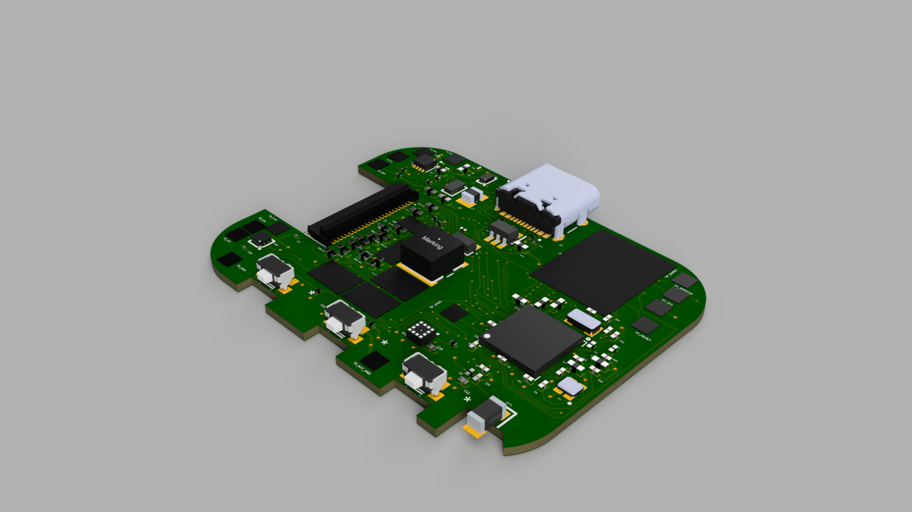
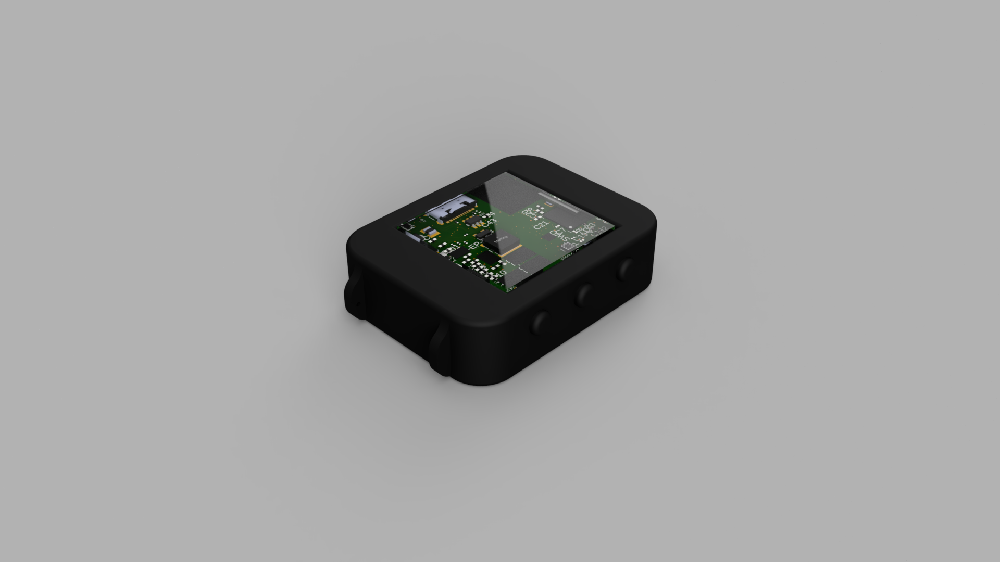

# InkTime Watch


Made by: Giurgiu Andrei-Ștefan 335CA


## Cuprins

1. [Prezentare generală](#1-prezentare-generală)
2. [Diagramă bloc](#2-diagramă-bloc)
3. [BOM – Bill of Materials](#3-bom--bill-of-materials)
4. [Descrierea hardware în detaliu](#4-descrierea-hardware-în-detaliu)
5. [Pinout nRF52840 – atribuire completă](#5-pinout-nrf52840--atribuire-completă)
6. [Estimare consum de energie](#6-estimare-consum-de-energie)
7. [Arhitectura firmware](#7-arhitectura-firmware)
8. [Aplicația mobilă companion](#8-aplicația-mobilă-companion)
9. [Randări produs](#9-randări-produs)

---

## 1. Prezentare generală

**InkTime** este un smartwatch conceput pentru a oferi:

- Afișaj e-paper 1.54" (200×200 px) cu refresh parțial o dată pe minut pentru un cadran digital clar, lizibil la orice lumină.
- Notificări BLE de pe telefon (profil tipic: ≤ 50 notificări/zi) cu alerte haptic.
- Numărare pași permanentă prin accelerometru cu pedometru integrat și trezire prin întrerupere.
- Încărcare USB-C și cale robustă de recuperare/programare prin Tag-Connect TC2030 SWD.

**Principii de proiectare:**

| Principiu | Descriere |
|---|---|
| Power first | Consum mediu minimizat; design interrupt-driven; fără conexiune BLE permanentă |
| Glanceable | UI simplu, contrast ridicat, fără ecrane dense cu text |
| Deterministic | Stări de putere predictibile; cale de recuperare robustă; fără stări hardware nedefinite |
| Buildable | Asamblare SMT repetabilă (JLC) și pași de asamblare manuală expliciți |

---

## 2. Diagramă bloc


**Legendă interfețe:**

| Interfață | Componente conectate |
|---|---|
| I²C (shared bus) | BQ25180, RT6160, MAX17048, BMA421, DRV2605L |
| SPI | E-paper display controller |
| GPIO | Butoane, PFET e-paper, întreruperi (INT1/INT2 accel, ALRT fuel gauge, /INT charger) |
| USB | nRF52840 native USB (D+/D-) + VBUS detect |
| SWD | Tag-Connect TC2030 (SWDIO, SWDCLK, nRESET) |

---

## 3. BOM – Bill of Materials


| # | Funcție | Componentă | Pachet | LCSC Part | Link JLCPCB | Datasheet |
|---|---|---|---|---|---|---|
| 1 | MCU (BLE + USB) | nRF52840-QIAA-R | aQFN73 7×7 | C190794 | [JLCPCB](https://jlcpcb.com/partdetail/NordicSemiconductor-nRF52840QIAAR/C190794) | [Datasheet](https://infocenter.nordicsemi.com/pdf/nRF52840_PS_v1.7.pdf) |
| 2 | Charger / power-path | BQ25180YBGR | DSBGA-8 | C3682423 | [JLCPCB](https://jlcpcb.com/partdetail/TexasInstruments-BQ25180YBGR/C3682423) | [Datasheet](https://www.ti.com/lit/ds/symlink/bq25180.pdf) |
| 3 | Regulator 3.3V buck-boost | RT6160AWSC | WLCSP-15 | C7065276 | [JLCPCB](https://jlcpcb.com/partdetail/RichtekTech-RT6160AWSC/C7065276) | [Datasheet](https://www.richtek.com/assets/product_file/RT6160A/DS6160A-01.pdf) |
| 4 | Fuel gauge | MAX17048G+T10 | DFN-8 2×2 | C2682616 | [JLCPCB](https://jlcpcb.com/partdetail/MaximIntegrated-MAX17048GT10/C2682616) | [Datasheet](https://www.analog.com/media/en/technical-documentation/data-sheets/MAX17048-MAX17049.pdf) |
| 5 | Accelerometru / pedometru | BMA421 | LGA-12 2×2 | C5242966 | [JLCPCB](https://jlcpcb.com/partdetail/BoschSensortec-BMA421/C5242966) | [Datasheet](https://www.bosch-sensortec.com/media/boschsensortec/downloads/datasheets/bst-bma421-ds000.pdf) |
| 6 | Driver haptic | DRV2605LDGSR | VSSOP-10 | C527464 | [JLCPCB](https://jlcpcb.com/partdetail/TexasInstruments-DRV2605LDGSR/C527464) | [Datasheet](https://www.ti.com/lit/ds/symlink/drv2605l.pdf) |
| 7 | Motor vibrant ERM | LCM1027B3605F | Wire leads | C7528806 | [JLCPCB](https://jlcpcb.com/partdetail/C7528806) | [Datasheet](https://datasheet.lcsc.com/lcsc/2208251630_NOVASEN-LCM1027B3605F_C7528806.pdf) |
| 8 | PFET (power gate EPD) | SI2301CDS | SOT-23 | C10487 | [JLCPCB](https://jlcpcb.com/partdetail/Vishay-SI2301CDS/C10487) | [Datasheet](https://www.vishay.com/docs/63524/si2301cds.pdf) |
| 9 | Conector debug | Tag-Connect TC2030-IDC | PCB footprint | — | [Tag-Connect](https://www.tag-connect.com/product/tc2030-idc-nl) | [Pinout](https://www.tag-connect.com/wp-content/uploads/bsk-pdf-manager/2019/10/TC2030-IDC-NL.pdf) |
| 10 | Afișaj e-paper | 1.54" EPD 200×200 (Good Display GDEW0154M09 sau echivalent) | FPC | — | [Good Display](https://www.good-display.com) | [Datasheet](https://www.good-display.com/companyfile/459.html) |


---

## 4. Descrierea hardware în detaliu

### 4.1 MCU – nRF52840-QIAA

nRF52840 este microcontrolerul central al proiectului. Integrează:

- Procesor ARM Cortex-M4F @ 64 MHz
- Radio BLE 5.0 + IEEE 802.15.4
- USB 2.0 Full Speed nativ (D+/D-)
- 1 MB Flash, 256 KB RAM
- Periferice hardware: multiple SPI, I²C, UART, PWM, ADC, comparatoare

**Alimentare MCU:**

| Rail | Conexiune | Valoare / Notă |
|---|---|---|
| VDD (toți pinii) | VDD 3V3 | 3.3V de la RT6160 |
| VDDH | VDD 3V3 | Mod normal-voltage (nu high-voltage) |
| VSS + pad expus | GND plane | |
| DEC1 | 100nF la GND | |
| DEC4 + DEC6 | 1µF la GND | Nodul DC/DC intern REG1 |
| DECUSB | 4.7µF la GND | Filtrare USB |

**DC/DC intern (REG1):** Firmware-ul activează DCDC1 la runtime. Circuitul extern: DCC → 10µH → 15nH → nod DEC4/DEC6.

**Cristale:**

| Cristal | Pini | Scopul |
|---|---|---|
| 32 MHz | XC1 / XC2 | Sistem principal, radio BLE, USB |
| 32.768 kHz | XL1 / XL2 | RTC, timekeeping, minute tick |

Condensatorii de sarcină ai cristalelor se dimensionează în funcție de CL-ul cristalului ales (ajustare posibilă pe board).

---

### 4.2 Charger – BQ25180YBGR

BQ25180 este un charger linear/power-path pentru LiPo de până la 1A, cu interfață I²C.

**Rol în sistem:**

- Primește 5V de pe USB-C pe pinul IN.
- Oferă VSYS pe pinul SYS — rail intermediar care alimentează regulatorul RT6160.
- Gestionează încărcarea bateriei LiPo pe pinul BAT cu protecție integrată (supraîncărcare, supraîncălzire, scurtcircuit).

**Conexiuni cheie:**

| Pin BQ25180 | Conexiune |
|---|---|
| IN | VBUS 5V (USB) |
| BAT | VBAT (LiPo +) |
| SYS | VSYS → RT6160 VIN |
| SCL / SDA | I²C shared bus |
| /INT | GPIO MCU (întrerupere opțională pentru evenimente charger) |
| TS / MR | Strapped cu 10kΩ la GND (Rev A) |

**Decuplare:** CIN = 1µF, CSYS = 10µF, CBAT = 1µF (minim, dimensionate cu derating termic).

**Adresă I²C:** `0x6A`

---

### 4.3 Regulator 3.3V – RT6160AWSC

RT6160 este un convertor buck-boost care menține 3.3V fix pe toată plaja de descărcare a LiPo (de la ~4.2V până la ~3.0V și sub). Asigură că VBAT scăzut nu provoacă brownout pe MCU sau periferice.

**Conexiuni cheie:**

| Pin RT6160 | Conexiune |
|---|---|
| VIN | VSYS (ieșirea SYS a BQ25180) |
| VOUT | VDD 3V3 |
| VSEL | GND (selectează fix 3.3V) |
| EN | VSYS (always-on când VSYS e prezent) |
| SCL / SDA | I²C shared bus (opțional, pentru telemetrie / DVFS viitor) |

**Componentă externă putere:** Inductor 0.47µH, input multi-22µF, output 10µF (valori recomandate Richtek).

**Adresă I²C:** `0x75`

---

### 4.4 Fuel Gauge – MAX17048G+T10

MAX17048 măsoară tensiunea bateriei LiPo prin algoritmul ModelGauge și raportează SOC (State of Charge) în procente prin I²C.

**Conexiuni cheie:**

| Pin MAX17048 | Conexiune |
|---|---|
| BAT / VDD | VBAT |
| SDA / SCL | I²C shared bus |
| ALRT | GPIO MCU (active low, pull-up la VDD 3V3) → sursă de trezire din sleep |

**Decuplare:** 0.1µF lângă VDD.

**Adresă I²C:** `0x36`

**Funcționalitate:** Pinul ALRT generează o întrerupere când SOC scade sub pragul configurat (ex. 5%) — MCU se trezește, afișează avertisment baterie slabă și/sau inițiază BLE disconnect.

---

### 4.5 Accelerometru / Pedometru – BMA421

BMA421 este un accelerometru triaxial de înaltă performanță cu pedometru hardware integrat, optimizat pentru purtabila (consum < 200µA în mod step counter).

**Mod de operare principal:** I²C (CSB strapped high, SDO strapped low → adresă 0x18).

**Conexiuni cheie:**

| Pin BMA421 | Conexiune |
|---|---|
| VDD / VDDIO | VDD 3V3 (decuplare 0.1µF per pin) |
| SDA / SCL | I²C shared bus |
| CSB | High → mod I²C |
| SDO | Low → adresă 0x18 |
| INT1 | P0.08 → trezire primară din Deep Sleep (pas detectat, motion) |
| INT2 | P1.08 → evenimente secundare / debug |

**Funcționalitate:** Pedometrul hardware numără pași fără implicarea MCU-ului. MCU se trezește doar la întreruperea INT1 pentru a citi și cumula datele, reducând consumul la minimum.

---

### 4.6 Driver haptic – DRV2605L + Motor ERM LCM1027B3605F

DRV2605L controlează motorul vibrant ERM (Eccentric Rotating Mass) prin forme de undă preprogramate stocate în ROM intern (biblioteca Immersion HD), selectate prin I²C.

**Conexiuni cheie:**

| Pin DRV2605L | Conexiune |
|---|---|
| VDD | VDD 3V3 (decuplare locală) |
| SDA / SCL | I²C shared bus |
| EN | P0.12 → shutdown complet între evenimente haptic |
| OUT+ / OUT- | Terminalele motorului ERM |

**Adresă I²C:** `0x5A`

**Politică de consum:** EN pus LOW între evenimente haptic elimină curentul de quiescent al driverului. Motorul rulează doar pe durata unui pattern (tipic 50–300ms).

---

### 4.7 Afișaj E-paper 1.54" (200×200)

Afișajul e-paper păstrează imaginea fără consum de energie în stare statică — ideal pentru un cadran de ceas. Consumă curent doar în timpul refresh-ului.

**Interfață:** SPI + 3 GPIO de control.

**Conexiuni cheie:**

| Semnal | Pin MCU | Rol |
|---|---|---|
| SCK | P0.02 | Clock SPI |
| MOSI | P0.03 | Date SPI (write-only) |
| CS | P0.05 | Chip select |
| DC | P0.15 | Data / Command select |
| RST | P0.16 | Reset panel |
| BUSY | P0.17 | Semnal panel ocupat (polling) |
| PFET gate | P1.01 | Power gate VEPD (prin rezistor 100Ω; pull-up 100kΩ gate-source) |

**Power gating VEPD:** Un P-FET (SI2301CDS) comutează alimentarea afișajului (VEPD) din VDD 3V3. Firmware-ul poate dezactiva VEPD complet între refresh-uri pentru a elimina curentul de leakage al display-ului și al FPC.

**Politică refresh:**

- Refresh parțial la fiecare minut (time update) — consum minim, fără ghosting vizibil pe termen scurt.
- Refresh complet la intervale configurabile (ex. la fiecare oră sau la cerere) pentru eliminarea ghosting-ului acumulat.

**Rezistori de serie opționali (DNP):** 100Ω–1kΩ pe liniile SPI/control pentru a reduce riscul de back-power când VEPD este dezactivat.

---

### 4.8 Butoane

Trei butoane mecanice active-low:

| Buton | Pin MCU | Conexiune |
|---|---|---|
| UP | P0.13 | GPIO → Switch → GND |
| DOWN | P0.14 | GPIO → Switch → GND |
| ENTER / ESC | P1.00 | GPIO → Switch → GND |

Firmware-ul activează pull-up intern pe fiecare pin și configurează wake-on-low + debounce software (tipic 20–50ms).

---

### 4.9 Interfața de programare – Tag-Connect TC2030 SWD

| Pin TC2030 | Semnal |
|---|---|
| 1 | VTref (VDD 3V3) — referință tensiune pentru debugger |
| 2 | SWDIO |
| 3 | GND |
| 4 | SWDCLK |
| 5 | GND |
| 6 | nRESET |

Board-ul este self-powered (baterie sau USB); TC2030 nu trebuie să furnizeze curent. VTref este obligatoriu pentru ca debugger-ul să detecteze tensiunea I/O a target-ului.

---

## 5. Pinout nRF52840 – atribuire completă

| Pin nRF52840 | Funcție | Componentă / Semnal | Justificare alegere |
|---|---|---|---|
| P0.02 | SPI SCK | E-paper clock | SPI0 hardware; alocare convenabilă pentru routing PCB |
| P0.03 | SPI MOSI | E-paper date | SPI0 hardware |
| P0.05 | SPI CS | E-paper chip select | GPIO flexibil, contiguitate cu celelalte pini SPI |
| P0.06 | I²C SDA | Bus I²C shared | I2C0 hardware Nordic; pull-up extern 10kΩ |
| P0.07 | I²C SCL | Bus I²C shared | I2C0 hardware Nordic; pull-up extern 10kΩ |
| P0.08 | GPIO INPUT | BMA421 INT1 | Capacitate sense GPIO → wake din Deep Sleep; pin cu DETECT |
| P0.12 | GPIO OUTPUT | DRV2605L EN | Control shutdown haptic; GPIO simplu sufficient |
| P0.13 | GPIO INPUT | Buton UP | Sense GPIO, wake-on-low, pull-up intern |
| P0.14 | GPIO INPUT | Buton DOWN | Sense GPIO, wake-on-low, pull-up intern |
| P0.15 | GPIO OUTPUT | EPD DC | Control Data/Command display; GPIO rapid |
| P0.16 | GPIO OUTPUT | EPD RST | Reset panel; GPIO simplu |
| P0.17 | GPIO INPUT | EPD BUSY | Polling stare panel; GPIO simplu |
| P1.00 | GPIO INPUT | Buton ENTER/ESC | Sense GPIO, wake-on-low, pull-up intern |
| P1.01 | GPIO OUTPUT | PFET gate VEPD | Control alimentare afișaj; pull-up extern gate-source (default OFF) |
| P1.08 | GPIO INPUT | BMA421 INT2 | Eveniment secundar accelerometru / debug |
| USBDP / USBDM | USB D+ / D- | USB-C conector | Pereche diferențială native USB nRF52840; ESD lângă conector |
| VBUS | USB VBUS detect | USB 5V | Detecție attach/detach USB |
| SWDIO / SWDCLK | SWD | TC2030 pin 2 / 4 | Programare și debug hardware |
| nRESET | Reset | TC2030 pin 6 | Resetare externă prin debugger |
| XC1 / XC2 | Crystal 32 MHz | Cristal extern | Ceas sistem, radio BLE, USB |
| XL1 / XL2 | Crystal 32.768 kHz | Cristal RTC extern | RTC, minute tick, sleep scheduling |
| DEC1 | Decuplare | 100nF → GND | Rail intern nRF |
| DEC4 / DEC6 | Decuplare DC/DC | 1µF → GND | Nod inductor DC/DC REG1 |
| DECUSB | Decuplare USB | 4.7µF → GND | Filtrare rail USB intern |

**Bus I²C – hartă adrese (7-bit):**

| Adresă | Dispozitiv |
|---|---|
| 0x18 | BMA421 (accelerometru) |
| 0x36 | MAX17048 (fuel gauge) |
| 0x5A | DRV2605L (haptic driver) |
| 0x6A | BQ25180 (charger) |
| 0x75 | RT6160 (regulator) |


---

## 6. Estimare consum de energie

### 6.1 Profilul tipic de utilizare

| Eveniment | Frecvență | Energie estimată |
|---|---|---|
| Refresh parțial e-paper | 1×/minut | ~5–15 mJ/refresh |
| Notificare BLE + haptic + display | 50×/zi | ~10–20 mJ/eveniment |
| Step counter (BMA421) | continuu (MCU dormit) | ~5–10 µA curent static BMA421 |
| Deep Sleep MCU | majoritar | ~3–5 µA (MCU) + RTC |

### 6.2 Buget curent mediu (estimat)

| Componentă | Curent mediu estimat |
|---|---|
| nRF52840 Deep Sleep + RTC | ~3 µA |
| BMA421 step counter mode | ~5 µA |
| MAX17048 activ | ~23 µA |
| E-paper (static, VEPD off) | ~0 µA |
| E-paper refresh (parțial, 1/min, pulsed) | ~150–300 µA mediat pe minut |
| **Total estimat mediu** | **~180–340 µA** |

> Cu o baterie LiPo de **300 mAh**, autonomia estimată este de **37–69 zile** în profil tipic. Valorile finale se validează prin măsurători pe Rev A (conform Power Budget Checklist din DD).

---

## 7. Arhitectura firmware

### 7.1 Stack

- **RTOS:** Zephyr OS (recomandat pentru maturitate BLE stack) sau event loop lightweight.
- **Limbaj:** C / C++ (Zephyr NCS).

### 7.2 Module principale

| Modul | Responsabilități |
|---|---|
| HAL | GPIO, I²C, SPI, timere, întreruperi, watchdog |
| Power Manager | Stări sleep, surse wake, duty cycles, power gating display |
| Timekeeping | RTC, timezone, sincronizare timp, planificare minute tick |
| Display Driver | Init, refresh parțial/complet, frame buffer, polling BUSY |
| BLE Manager | Advertising, conexiune, servicii GATT, notificări, bonding |
| Notification Service | Coadă mesaje, deduplicare, politică render, trigger haptic |
| Activity Service | Init BMA421, citire pași, reset zilnic |
| Battery Service | Citiri MAX17048, alerte baterie slabă, stare charger BQ25180 |
| Haptics Service | Init DRV2605L, pattern-uri, politică enable/disable |
| Storage | NVM pentru setări, istoric pași, preferințe notificări |
| Diagnostics | Log-uri debug, info build, hook-uri self-test |

### 7.3 Stări de putere și surse de trezire

```
┌─────────────┐   RTC tick / Button / INT / BLE event  ┌──────────────┐
│  Deep Sleep  │──────────────────────────────────────►│   Active      │
│ (radio off)  │◄──────────────────────────────────────│ (render/BLE)  │
└─────────────┘           Task complet                 └──────────────┘
        ▲                                                      │
        │                   Idle/Standby                       │
        └──────────────────────────────────────────────────────┘
```

**Surse de trezire din Deep Sleep:**

- RTC minute tick
- Butoane (GPIO sense)
- BMA421 INT1/INT2 (pași/mișcare)
- MAX17048 ALRT (prag baterie slabă)
- BQ25180 /INT (eveniment charger)
- BLE events (ferestre programate)

### 7.4 Servicii BLE GATT (MVP)

| Serviciu | UUID | Descriere |
|---|---|---|
| Device Information (DIS) | Standard | Model, versiune firmware |
| Battery Service (BAS) | Standard | Procent baterie (MAX17048) |
| Custom Notification Service | Custom | Push notificări, clear, ack |
| Time Sync | Custom | Setare oră/timezone; proxy NTP opțional |
| DFU Service | Custom (opțional) | Update firmware OTA |

**Payload notificare:** timestamp, app id, titlu, corp (trunchiat), prioritate, vibration pattern id — optimizat pentru BLE MTU cu suport chunking.

---

## 8. Aplicația mobilă companion

### 8.1 Strategie platformă

- MVP: o platformă prima (Android sau iOS), cu plan clar de paritate.
- Cross-platform: Flutter sau React Native dacă cerințele BLE stack sunt satisfăcute.
- Native: Kotlin (Android) / Swift (iOS) pentru fiabilitate BLE maximă.

### 8.2 Module app

| Modul | Responsabilități |
|---|---|
| BLE Transport | Scan, connect, bonding, MTU, reconectare, comportament background |
| Device Model | Stare cached: baterie, firmware, setări, last seen |
| Notification Bridge | Capturare notificări OS, filtrare, formatare, coadă send |
| Settings UI | Allowlist/blocklist, ore liniștite, pattern-uri vibrație |
| Time Service | Sincronizare oră + timezone, politică drift |
| DFU/Update | Download/verify firmware, transfer, progres, rollback |

### 8.3 Pipeline notificări

```
Eveniment OS → Filtrare reguli (app list, quiet hours) → Render payload compact →
→ Coadă cu retry/backoff (dacă watch deconectat) → Send BLE → Ack opțional
```

---

### 9 Randări produs



